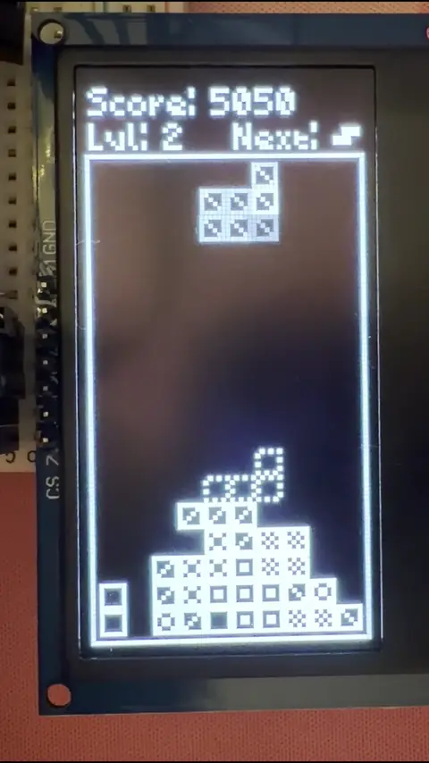
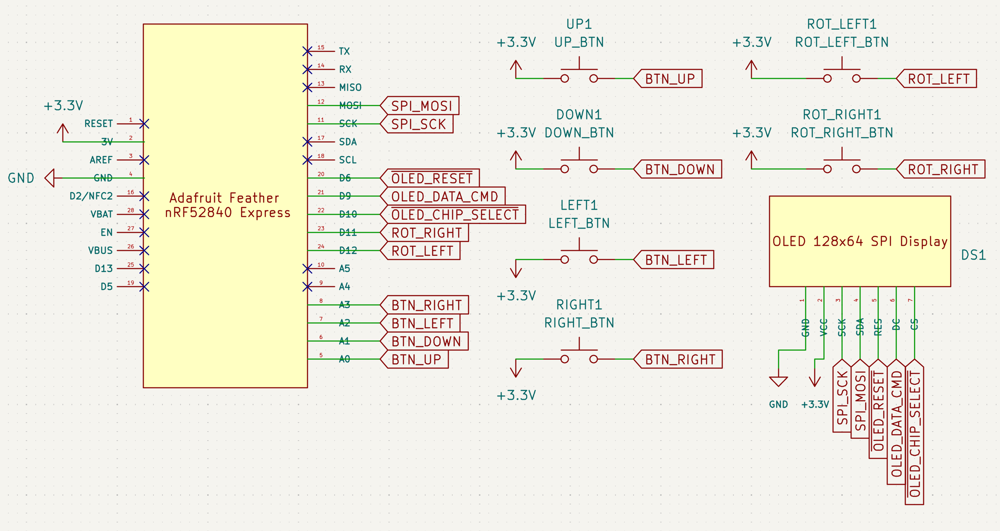
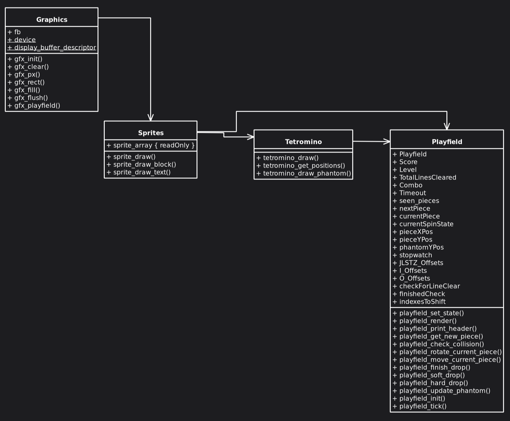

# Tetromini (In Active Development)
## About
Tetromini is a portable console based on an Adafruit Feather nRF52840 Express running a custom-made Zephyr-based firmware that plays a fan-made version of a falling-block puzzle game!

The project consists of multiple parts. As of writing, the firmware that controls the console itself and the game inside the firmware have a working version!

The project itself can also be compiled using native_sim and be therefore playable in your host machine. As an aside, the window will be rotated, given that the display is 128x64, but it is oriented vertically on the circuitry.

Future developments want to explore things such as:
- [ ] I2S Audio
- [ ] Game over screens
- [ ] High score tracking
- [ ] Sharing high scores via bluetooth
- [ ] Portable power handling (including soft turning on and off)
- [ ] Creating a buddy app that keeps track of fun info about your Tetromini console
- [ ] A custom PCB Hat for the Feather
- [ ] A custom enclosure shaped like a tetrimino

## Features
- 4 directional inputs (move left, move right, soft drop, hard drop)
- Clockwise and counterclockwise rotation
- Dynamic gravity and boosted score based on level
- Combo points per consecutive line clears

## Schematics
The below KiCad schematic is based on Rev 1, running on a breadboard. (last updated Sep 28th 2026)

BOM Generated via KiCad for Rev 1 (last updated Sep 28th 2026):
| Reference                                   | Description                             | MPN      | DigiKey_PN                 | Manufacturer |
|---------------------------------------------|-----------------------------------------|----------|----------------------------|--------------|
| DOWN1,LEFT1,RIGHT1,ROT_LEFT1,ROT_RIGHT1,UP1 | Push button switch, generic, two pins   | MJTP1234 | 679-2442-ND |   APEM Inc.  |
| DS1                                         | Generic 2.42in SSD1309 OLED SPI Display | --       | --                         | HiLetgo      |
| U1                                          | Feather nRF52840 Express                | 4062     | 1528-2828-ND               | Adafruit     |

## Firmware
The firmware running on the Feather is a custom-made Zephyr RTOS firmware! It abstracts away parts of the code into sub classes following this general UML Graph: (last updated Sep 28th 2026)

## Debugging
Debugging is achieved live on the board using a Segger J-Link EDU! This project is purely for learning's sake, so yay!

## Development Environment
This repo has a Docker container that is used to actually set up the entire workflow, installing specific versions of all the tools we need for development!

## Disclaimer
Tetris® is a registered trademark of The Tetris Company, LLC. This project is not affiliated with or endorsed by The Tetris Company.