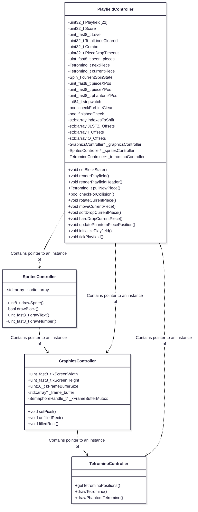

# Controllers
This is the overview of what controllers exist inside the Game Thread, and how they interact with each other!! :)

```mermaid
---
config:
  look: neo
  theme: redux-color
---
classDiagram
  class GraphicsController {
    +uint_fast8_t kScreenWidth
    +uint_fast8_t kScreenHeight
    +uint16_t kFrameBufferSize
    -std::array<uint8_t, kFrameBufferSize>* _frame_buffer
    -SemaphoreHandle_t* _xFrameBufferMutex;
    +void setPixel()
    +void unfilledRect()
    +void filledRect()
  }

  class SpritesController {
    -std::array<uint8_t, 749> _sprite_array
    +uint8_t drawSprite()
    +bool drawBlock()
    +uint_fast8_t drawText()
    +uint_fast8_t drawNumber()
  }

  class TetrominoController {
    +getTetrominoPositions()
    +drawTetromino()
    +drawPhantomTetromino()
  }

  class PlayfieldController {
    -uint32_t Playfield[22]
    -uint32_t Score
    -uint_fast8_t Level
    -uint32_t TotalLinesCleared
    -uint32_t Combo
    -uint32_t PieceDropTimeout
    -uint_fast8_t seen_pieces
    -Tetromino_t nextPiece
    -Tetromino_t currentPiece
    -Spin_t currentSpinState
    -uint_fast8_t pieceXPos
    -uint_fast8_t pieceYPos
    -uint_fast8_t phantomYPos
    -int64_t stopwatch
    -bool checkForLineClear
    -bool finishedCheck
    -std::array<uint_fast8_t, 4> indexesToShift
    -std::array<int8_t, 40> JLSTZ_Offsets
    -std::array<int8_t, 40> I_Offsets
    -std::array<bool, 8> O_Offsets
    -GraphicsController* _graphicsController
    -SpritesController* _spritesController
    -TetrominoController* _tetrominoController
    +void setBlockState()
    +void renderPlayfield()
    +void renderPlayfieldHeader()
    +Tetromino_t pullNewPiece()
    +bool checkForCollision()
    +void rotateCurrentPiece()
    +void moveCurrentPiece()
    +void softDropCurrentPiece()
    +void hardDropCurrentPiece()
    +void updatePhantomPiecePosition()
    +void initializePlayfield()
    +void tickPlayfield()
  }

SpritesController..>GraphicsController:Contains pointer to an instance of
GraphicsController..>TetrominoController:Contains pointer to an instance of
PlayfieldController..>GraphicsController:Contains pointer to an instance of
PlayfieldController..>SpritesController:Contains pointer to an instance of
PlayfieldController..>TetrominoController:Contains pointer to an instance of
```