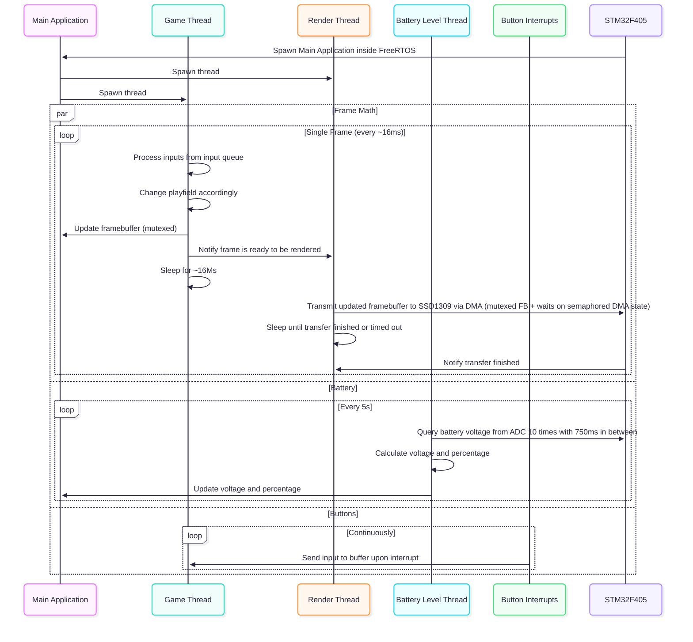

# Threads
This is the overview of what threads exist in the app, and how they interact with each other, the overarching application, and the circuitry itself!

```mermaid
---
config:
  look: neo
  theme: redux-color
---
sequenceDiagram
    participant App as Main Application
    participant Game as Game Thread
    participant Render as Render Thread
    participant Battery as Battery Level Thread
    participant ButtonISR as Button Interrupts
    participant MCU as STM32F405

    MCU->>App: Spawn Main Application inside FreeRTOS

    App->>Render: Spawn thread
    App->>Game: Spawn thread

    par Frame Math
        loop Single Frame (every ~16ms)
            Game->>Game: Process inputs from input queue
            Game->>Game: Change playfield accordingly
            Game->>App: Update framebuffer (mutexed)
            Game->>Render: Notify frame is ready to be rendered
            Game->>Game: Sleep for ~16Ms
            Render->>MCU: Transmit updated framebuffer to SSD1309 via DMA (mutexed FB + waits on semaphored DMA state)
            Render->>Render: Sleep until transfer finished or timed out
            MCU->>Render: Notify transfer finished
        end
    and Battery
        loop Every 5s
            Battery->>MCU: Query battery voltage from ADC 10 times with 750ms in between
            Battery->>Battery: Calculate voltage and percentage
            Battery->>App: Update voltage and percentage
        end
    and Buttons
        loop Continuously
            ButtonISR->>Game: Send input to buffer upon interrupt
        end
    end
```